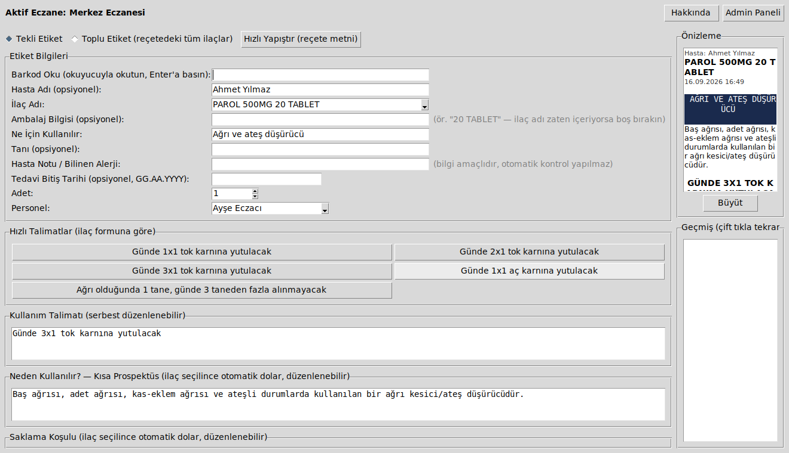

# Eczane Etiket Programı

Eczacının, ilaç kutusuna/poşetine yapıştırdığı **kullanım talimatı
etiketini** ("Günde 2×1 tok karnına yutulacak" gibi) birkaç tıkla
hazırlayıp yazdırmasını sağlayan, bağımsız ve **tamamen ücretsiz** bir
masaüstü programıdır.

**Basitçe özetle:** Hesap açmanıza, internete bağlanmanıza ya da bir
şeye abone olmanıza gerek yok. Programı bilgisayarınıza kurarsınız,
ilacı seçersiniz, talimatı yazarsınız, yazdırırsınız — bu kadar. Tüm
bilgiler yalnızca sizin bilgisayarınızda saklanır, hiçbir yere gönderilmez.

Açık kaynak kodludur (MIT lisansı): kaynak kodu herkese açıktır, isteyen
inceleyebilir, değiştirebilir, kendi ihtiyacına göre uyarlayabilir.



## İçindekiler

- [Bu Program Tam Olarak Ne Yapar?](#bu-program-tam-olarak-ne-yapar)
- [Hızlı Başlangıç](#hızlı-başlangıç)
- [Günlük Kullanım — Adım Adım](#günlük-kullanım--adım-adım)
- [Özellikler](#özellikler)
- [Admin Paneli Nedir?](#admin-paneli-nedir)
- [Sık Sorulan Sorular](#sık-sorulan-sorular)
- [Sınırlamalar](#sınırlamalar)
- [Geliştiriciler İçin](#geliştiriciler-için)
- [Lisans](#lisans)

## Bu Program Tam Olarak Ne Yapar?

Piyasadaki bazı eczane etiket sistemlerinin yaptığı işi, tek başına ve
ücretsiz yapar:

1. İlacı listeden seçersiniz (ya da barkod okutursunuz).
2. İlacın formuna göre (tablet, şurup, damla, krem, vb.) hazır talimat
   butonlarından birine tıklarsınız — ya da kendiniz yazarsınız.
3. "Yazdır" dersiniz; küçük termal etiket ya da A4 sayfa üzerine 6'lı
   ızgara olarak, eczane adınız ve talimat yazılı bir etiket çıkar.

Bunun yanında geçmiş kayıtları (hangi hastaya ne verilmiş), stok/son
kullanma tarihi takibi, birden fazla eczane profili gibi ek araçlar da
sunar — ama temel iş yukarıdaki üç adımdır.

## Hızlı Başlangıç

Programı çalıştırmak için bilgisayarınızda **Python** kurulu olması
yeterlidir (Windows, Mac, Linux hepsinde çalışır).

1. Python kurulu değilse [python.org](https://www.python.org/downloads/)
   adresinden indirip kurun (kurulumda "Add to PATH" seçeneğini işaretleyin).
2. Bu depoyu bilgisayarınıza indirin — sağ üstteki yeşil **"Code"**
   butonuna basıp **"Download ZIP"** seçin, ya da git kuruluysa:
   ```bash
   git clone https://github.com/Bluetwinklez/cll.git
   cd cll
   ```
3. Gerekli kütüphaneleri kurun:
   ```bash
   pip install -r requirements.txt
   ```
4. Programı başlatın:
   ```bash
   python run_app.py
   ```

İlk açılışta size eczane adı/telefonu soran küçük bir pencere çıkar —
doldurup "Kaydet"e basmanız yeterli, sonra tekrar sorulmaz.

**Not:** Python kurmak istemeyen bir çalışanınız varsa, programı tek
tıkla açılan bir `.exe` dosyasına da dönüştürebilirsiniz — bkz.
[Geliştiriciler İçin](#geliştiriciler-için) bölümündeki "Windows .exe
Oluşturma" kısmı.

## Günlük Kullanım — Adım Adım

Program açıldığında karşınıza **"Hızlı Etiket"** ekranı gelir; günlük
işiniz burada biter:

1. **İlaç Adı** kutusuna yazmaya başlayın — liste yazdıkça daralır. Ya da
   üstteki **Barkod Oku** kutusuna barkod okuyucuyla ürünü okutun.
2. İlacı seçince, varsa **"Ne İçin Kullanılır"**, **"Neden Kullanılır?"**
   (kısa prospektüs) ve **"Saklama Koşulu"** alanları otomatik dolar —
   isterseniz düzenleyebilirsiniz.
3. Altındaki **hızlı talimat butonlarından** birine tıklayın (ilacın
   formuna göre değişir: tablet için "Günde 2x1 tok karnına yutulacak"
   gibi, krem için "İnce tabaka halinde sürülecek" gibi) — ya da talimatı
   kendiniz serbestçe yazın.
4. İsterseniz **Hasta Adı**, **Tanı**, **Hasta Notu** (örn. bilinen
   alerji) gibi ek bilgileri doldurun.
5. Sağdaki **önizlemeden** etiketin son halini görün, **"Büyüt"** ile
   daha net inceleyin.
6. **"Yazdır"** (`Ctrl+P`) ile doğrudan yazıcıya gönderin, ya da
   **"PDF Olarak Kaydet"** ile dosya olarak saklayın.

**Bir reçetede birden fazla ilaç varsa:** Üstte **"Toplu Etiket"**
moduna geçin; her ilacı tek tek doldurup **"Sepete Ekle"**ye basın,
sonuncusunu ekledikten sonra tek seferde hepsini yazdırın.

**Reçete metnini elle yazmak istemiyorsanız:** **"Hızlı Yapıştır"**
butonuna basıp, elinizdeki reçete metnini (örn. Medula ekranından
kopyaladığınız) kutuya yapıştırın, **"Ayrıştır"**a basın — program
ilaçları otomatik tanıyıp toplu listeye hazırlar. Siz sadece kontrol
edip yazdırırsınız (bkz. [Sık Sorulan Sorular](#sık-sorulan-sorular)).

## Özellikler

**Etiket oluşturma**
- Forma göre (tablet, kapsül, şurup, damla, merhem/krem, süpozituvar,
  sprey) otomatik değişen hazır talimat butonları
- Hasta adı, tanı, hasta notu/bilinen alerji, tedavi bitiş tarihi gibi
  opsiyonel alanlar (bitiş tarihi yanlış formatta girilirse uyarır)
- Etikette sabit ve mantıklı sıra: önce neden kullanıldığı, sonra nasıl
  kullanılacağı, sonra saklama koşulu
- Tekli ve toplu (bir reçetedeki birden fazla ilaç) etiket modu
- **Hızlı Yapıştır**: reçete metnini yapıştırıp ilaçları otomatik
  ayrıştırarak toplu listeye aktarma (bir Medula bağlantısı değildir,
  tamamen elle kopyala/yapıştıra dayanır — bkz. SSS)
- Barkod okuyucu desteği: ürünü okutunca ilaç otomatik seçilir
- Büyütülebilir canlı önizleme, yazdırma (`Ctrl+P`) ve PDF olarak kaydetme
- Küçük termal etiket (50x30 / 60x40mm) ya da A4 sayfada 6'lı ızgara
  şablonu arasında seçim
- İsteğe bağlı QR kod (yalnızca A4 şablonunda — küçük etikette yer yok):
  ilaç bilgilerini gösteren, tamamen çevrimdışı okunan küçük bir kod
- Türkçe karakterler (ı, İ, ş, Ş, ğ, Ğ) gömülü font sayesinde her
  bilgisayarda doğru basılır
- Adres ve emoji yok — etiket sade ve düzenli kalır

**Yönetim ve takip** (bkz. [Admin Paneli Nedir?](#admin-paneli-nedir))
- Eczane profilleri, ilaç listesi yönetimi, talimat şablonları, personel
  listesi, istatistikler, stok/SKT takibi, yedekleme (opsiyonel PIN korumalı)

## Admin Paneli Nedir?

Ana ekrandaki **"Admin Paneli"** butonuyla açılan, yönetimsel işlerin
toplandığı ayrı bir pencere. Her sekme bir konuya bakar:

| Sekme | Ne İşe Yarar |
|---|---|
| Eczane Profilleri | Eczane adı/telefon, birden fazla şube profili, opsiyonel PIN kilidi |
| İlaç Listesi | İlaçları görme/ekleme/silme, CSV/Excel'den toplu içe aktarma |
| İlaç Veri Kaynağı | İsteyenler için opsiyonel dış API bağlantısı (bkz. SSS) |
| Talimat Şablonları | Hızlı talimat butonlarının metnini forma göre düzenleme |
| Personel | "Kim bastı" notu için basit bir isim listesi |
| Geçmiş & Raporlar | Basılan tüm etiketler, hasta adına/tarih aralığına göre arama, CSV dışa aktarım |
| İstatistikler | En çok basılan ilaçlar, en aktif personel, son 7 günün etiket sayısı |
| Stok / SKT Takip | Ürün/miktar/son kullanma tarihi listesi, düşük stok ve yaklaşan SKT uyarısı |
| Yedekleme | Tüm verileri tek bir `.zip` dosyasına yedekleme/geri yükleme |

İstenirse silme işlemleri öncesi onay istenir, yanlışlıkla veri kaybını
önlemek için.

## Sık Sorulan Sorular

**İnternet bağlantısı gerekiyor mu?**
Hayır. Program tamamen çevrimdışı çalışır. İsteğe bağlı olarak (kapatılabilir)
bir ilaç veri kaynağı API'si bağlanabilir, ama bu kesinlikle zorunlu değildir.

**Gerçekten ücretsiz mi, gizli bir bedel var mı?**
Evet, tamamen ücretsiz ve açık kaynaktır (MIT lisansı). Reklam, abonelik,
lisans anahtarı yok.

**Medula'ya bağlanıp reçeteyi otomatik çekiyor mu?**
Hayır — ve bunun nedeni tembellik değil, güvenlik. Medula'nın eczane
tarafı için resmi/genel bir API yok, yalnızca eczanenin kendi SGK
kimlik bilgisiyle girdiği kapalı bir portal var. Doğrulanmamış bir
bağlantı yazmak, eczanenizin SGK erişimini riske atabilir. Bunun yerine
**Hızlı Yapıştır** özelliği var: Medula ekranındaki metni kopyalayıp
programa yapıştırırsınız, program ilaçları tanımaya çalışır — ama
hiçbir sunucuya bağlanmaz, siz yazdırmadan önce mutlaka kontrol edersiniz.

**Verilerim (hasta bilgileri, geçmiş, stok) nerede saklanıyor?**
Sadece kendi bilgisayarınızda, `~/.eczane_etiket/` klasöründe (basit
JSON dosyaları olarak). Hiçbir sunucuya gönderilmez. Bu git deposuna da
dahil değildir.

**Birden fazla bilgisayarda/şubede kullanabilir miyim?**
Evet, her bilgisayara ayrı ayrı kurulur (veriler birbirinden bağımsızdır).
Tek bir bilgisayarda birden fazla eczane/şube profili arasında da geçiş
yapılabilir. Bilgisayarlar arası otomatik senkronizasyon yoktur — istenirse
Yedekleme özelliğiyle bir `.zip` dosyası aktarılabilir.

**İlaç bilgileri (ne işe yaradığı vb.) güvenilir mi?**
Örnek listedeki açıklamalar yalnızca genel bilinirlikte, tartışmasız
bilgilerle doldurulmuştur; emin olunmayan alanlar bilerek boş
bırakılmıştır (uydurma veri yoktur). Bu, resmi bir kısa ürün bilgisi/
kullanma talimatının yerine geçmez.

**Programı geliştirebilir miyim / hata bulursam ne yapmalıyım?**
Kod tamamen açık, GitHub Issues üzerinden hata bildirebilir ya da Pull
Request açabilirsiniz — bkz. [Geliştiriciler İçin](#geliştiriciler-için).

## Sınırlamalar

- Medula'ya canlı bağlantı yoktur (yukarıda açıklandı).
- Hızlı Yapıştır kesin bir ayrıştırma garantisi vermez; yazdırmadan önce
  mutlaka kontrol edilmelidir.
- Hasta notu/alerji alanı yalnızca eczacının kendi yazdığı bir
  hatırlatmadır; otomatik ilaç etkileşim/alerji kontrolü yapılmaz.
- İstatistik panosu basit bir özet aracıdır, resmi bir raporlama sistemi
  değildir.

## Geliştiriciler İçin

Bu bölüm, kodu inceleyecek, katkı verecek ya da `.exe` paketleyecek
kişiler içindir — günlük kullanım için gerekli değildir.

### Proje Yapısı

```
cll/
├── run_app.py                  # Giriş noktası
├── eczane_etiket/
│   ├── main.py                  # Hızlı Etiket ana ekranı (Tkinter)
│   ├── admin_panel.py           # Yönetim paneli
│   ├── profiles.py              # Eczane profil(ler)i, PIN doğrulama
│   ├── data.py                  # İlaç seed listesi + forma göre talimat şablonları
│   ├── drug_api.py              # Yapılandırılabilir, opsiyonel ilaç veri API istemcisi
│   ├── drug_import.py           # CSV/Excel içe aktarma
│   ├── label_pdf.py             # reportlab ile etiket PDF üretimi + yazdırma
│   ├── history.py               # Etiket geçmişi + arama + CSV export
│   ├── stats.py                 # İstatistik/özet panosu
│   ├── prescription_parser.py   # "Hızlı Yapıştır" reçete metni ayrıştırma
│   ├── stock.py                 # Stok/SKT takibi + düşük stok eşiği
│   ├── backup.py                # Yedekleme/geri yükleme (.zip)
│   ├── staff.py                 # Personel listesi
│   ├── paths.py / jsonutil.py   # Ortak veri yolu ve JSON okuma/yazma yardımcıları
│   ├── icons/                   # Uygulama ikonu
│   └── fonts/                   # Gömülü DejaVu Sans (Türkçe karakter desteği)
├── tests/                       # pytest test paketi
├── eczane_etiket.spec           # PyInstaller derleme yapılandırması
└── requirements*.txt
```

### İlaç Veri Kaynağı ve API Anahtarı Hakkında

Program varsayılan olarak hiçbir dış servise bağlanmaz. İsteyen kullanıcı,
Admin Panelindeki "İlaç Veri Kaynağı" sekmesinden isteğe bağlı olarak açık
kaynak [`turkish-medicine-api`](https://github.com/tugcantopaloglu/turkish-medicine-api)
gibi bir servisin adresini girebilir (herkese açık barındırılan bir servis
değildir, kendi sunucunuzda çalıştırmanız gerekir).

**Güvenlik notu:** Girilen API anahtarı hiçbir zaman koda/git deposuna
yazılmaz — yalnızca `~/.eczane_etiket/api_config.json` içinde yerel
saklanır, arayüzde `*` ile gizlenir. Bu depoda (kod veya git geçmişinde)
hiçbir gerçek anahtar/sır yoktur.

### Testler

```bash
pip install -r requirements-dev.txt
python -m pytest tests/
```

### Windows İçin Tek Dosya .exe Oluşturma

**Windows bilgisayarda** (PyInstaller çapraz derleme yapmaz):

```bat
pip install -r requirements-dev.txt
pyinstaller eczane_etiket.spec
```

Çıktı `dist\EczaneEtiket.exe` olur; Türkçe font ve uygulama ikonu otomatik
pakete dahil edilir (`eczane_etiket.spec` içindeki `datas`/`icon` ayarları).

### Veri Saklama (Teknik Detay)

`~/.eczane_etiket/` klasöründeki JSON dosyaları: `profiles.json`,
`drugs.json`, `templates.json`, `history.json`, `stock.json`,
`api_config.json`, `staff.json`. Hiçbiri bu git deposuna dahil değildir.

### Katkıda Bulunma

1. Depoyu fork'layın ve bir özellik/düzeltme dalı açın.
2. Değişikliğinizi yapın, `python -m pytest tests/` ile testlerin geçtiğini
   doğrulayın.
3. Bir Pull Request açın.

Hata bildirimi veya özellik önerisi için GitHub Issues kullanabilirsiniz.

## Lisans

[MIT](LICENSE) — bu yazılımı ücretsiz olarak kullanabilir, değiştirebilir
ve dağıtabilirsiniz.

Sürüm geçmişi için [CHANGELOG.md](CHANGELOG.md) dosyasına bakabilirsiniz.
